**Environment:** Hyper‑V • Windows Server 2025 • Windows 10 (client)  
**Domain:** `nti.local` • **VIP (NLB):** `192.168.5.50` → `www.nti.local`

A compact, production‑style lab demonstrating **core directory resiliency** and **stateless web HA**. This reads like a handover you’d give a customer: clear architecture, rationale, validation, and runbooks—with inline evidence.

---

## 🔎 Executive Summary — What this delivers
- **Resilient core services:** Two Domain Controllers (DC1/DC2) provide **AD DS**, **AD‑integrated DNS**, and **DHCP Failover (Load Balance 50/50)** so clients keep resolving and receiving leases during maintenance or node loss.
- **Web HA without app changes:** Two IIS nodes (WEB1/WEB2) behind **Windows Network Load Balancing (NLB)** in **Multicast** mode with **Affinity=None**, exposed on VIP **`192.168.5.50`** as **`www.nti.local`**.
- **Policy & hygiene:** **FSRM** blocks risky binaries in redirected folders; **Loopback = Replace** keeps server/DC logons locked down; **FGPP** adds differentiated password rules; **Delegation** shows targeted GPO exemption (user *Doaa*).
- **Operator friendly:** Clear **validation checklist** and **zero‑downtime runbooks** for patching and failover tests.

> **Business impact (typical internal LOB apps):**  
> • Patch windows shrink (patch nodes independently via **Drainstop/Resume**).  
> • DC/DHCP maintenance doesn’t disrupt users; node restarts become routine events.  
> • FSRM prevents common malware/script drops into shared folders.

---

## 🧭 Architecture
| Tier | Hostname | IP | Role / Notes |
|---|---|---|---|
| Core | **DC1** | **192.168.5.10** | AD DS, DNS, DHCP (failover partner) |
| Core | **DC2** | **192.168.5.20** | AD DS, DNS, DHCP; **Schema Master**; iSCSI targets *(lab only)* |
| Web  | **WEB1** | **192.168.5.30** | IIS behind NLB |
| Web  | **WEB2** | **192.168.5.40** | IIS behind NLB |
| VIP  | **www.nti.local** | **192.168.5.50** | NLB **Multicast**, **Affinity=None**, TCP/80 |
| Client | **CL1** | DHCP | Windows 10 test client |
| Mgmt | **CORE01** | – | Windows Server Core for remote admin |

> Diagram


**Validation at a glance**  


---

## 🧱 OU & GPO Design (with rationale)
**OU tree (purpose‑driven):**  
`Admins`, `IT`, `Users/Developers`, `Users/Clients`, `Servers/{Domain Controllers, Web Servers, Core Servers}`, `Workstations`

**Key GPOs**
- **Servers/DCs/Core — Loopback = Replace**  
  *Why:* when admins log on to servers, user settings must follow **server policy**, not workstation policy. Replace avoids conflicting UX/security settings.  
  _Evidence:_ 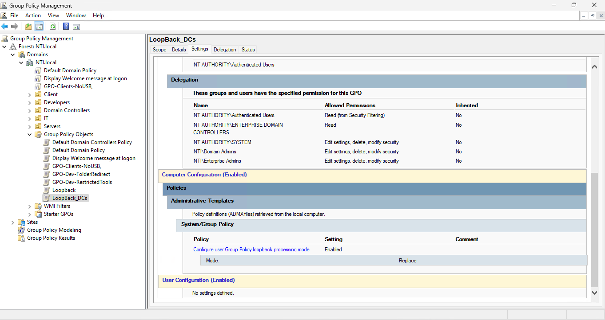

- **Developers — Folder Redirection + Drive Mapping (GPP) + Restricted Registry Tools**  
  *Why:* centralize data (`\\DC1\Docs`), provide **P:** drive, reduce risky tweaks.  
  **Delegation Exception (Doaa):** remove *Apply group policy* for user **Doaa** to demonstrate targeted exemptions.  
  _Evidence:_ 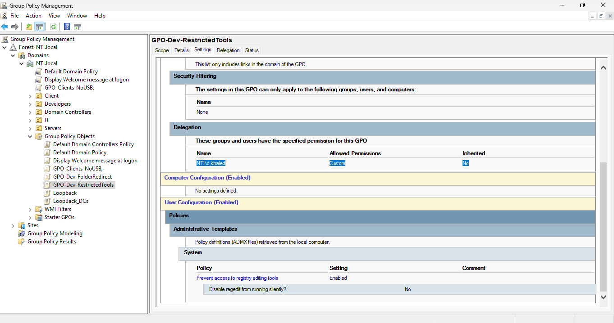
              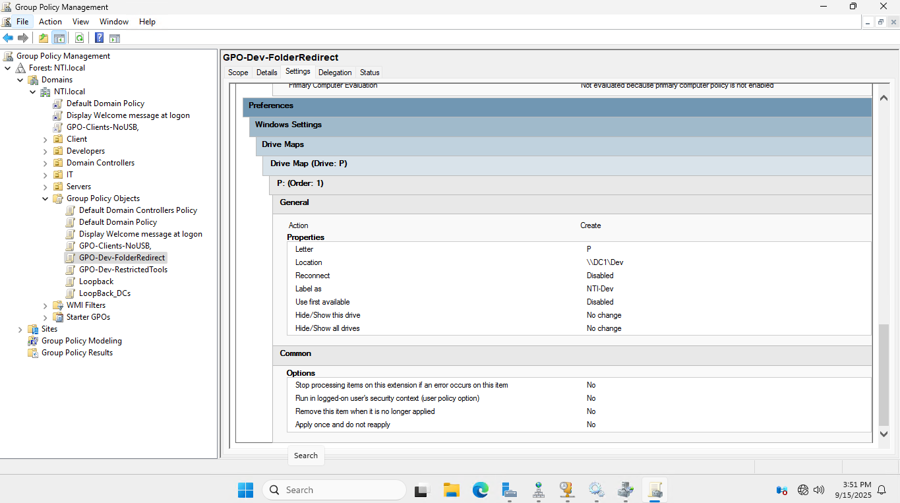
  
- **Clients — USB Block**  
  *Why:* baseline DLP; keeps policy surface separate from developers.

**FGPP (Fine‑Grained Password Policy)**  
Two PSOs for demonstration:  
- `PSO-DefaultUsers` → Len≥8, Hist=12, MaxAge=60d
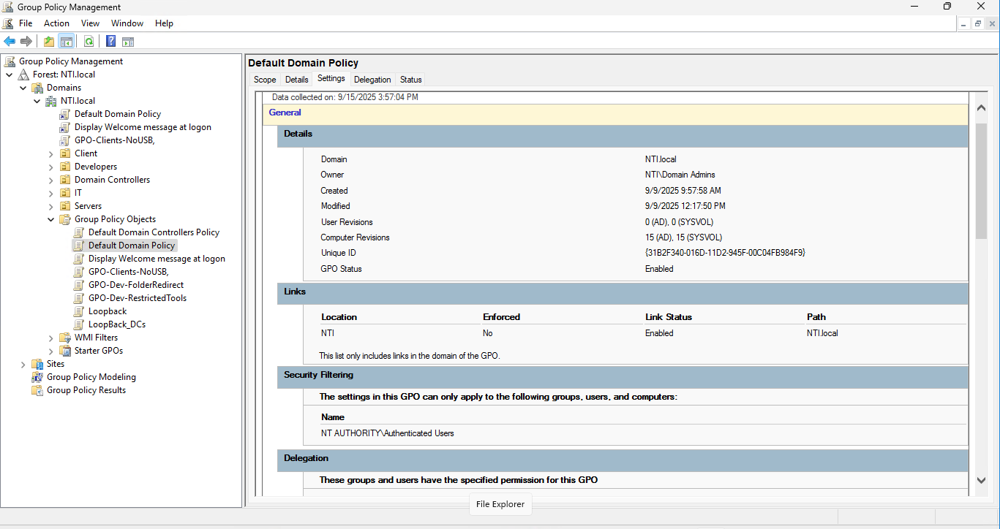
- `PSO-Mostafa` → Len≥14, Hist=24, MaxAge=30d (higher precedence)
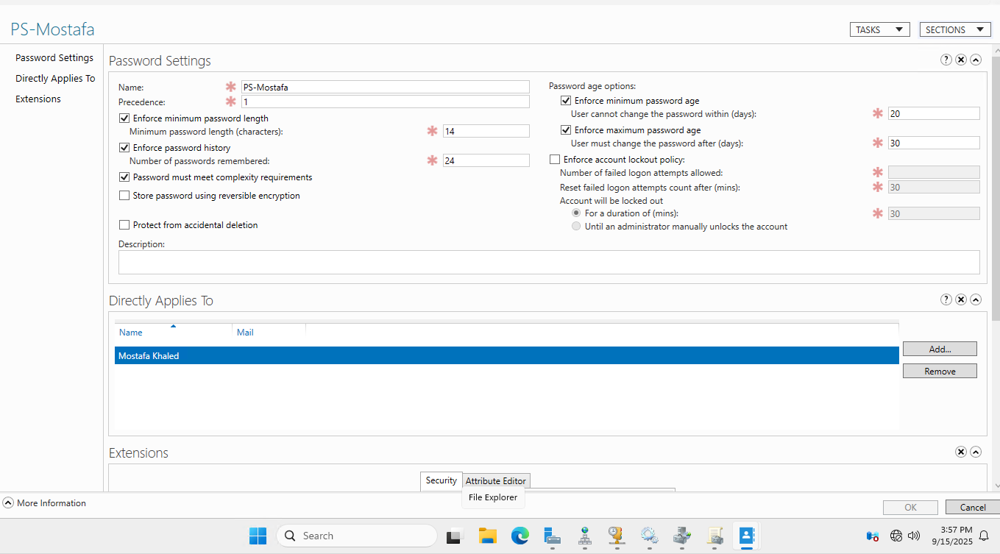

> **Tips:** avoid deep OU nesting; prefer Security Filtering + Delegation before “Enforce”; use WMI filters sparingly.

---

## 📂 Data Services — Shares & FSRM
- Shares: `\\DC1\Docs` (Folder Redirection), `\\DC1\Dev` (mapped to **P:** via GPP).  
- **FSRM**: File Group `BlockedDocsFiles` blocks `*.exe` and `*.ps1`; apply an **Active** file screen on `C:\Docs` to prevent risky binaries in redirected folders.  
  _Evidence:_
  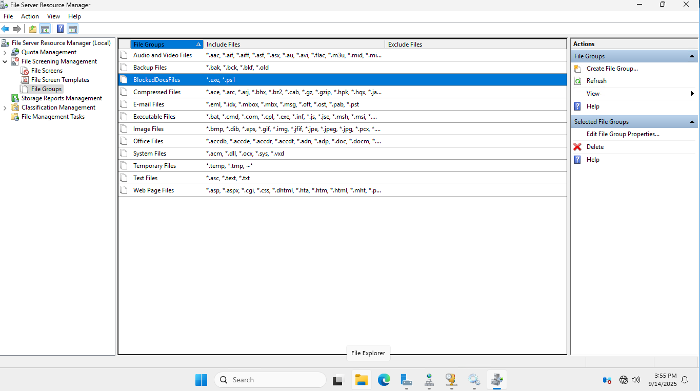  
  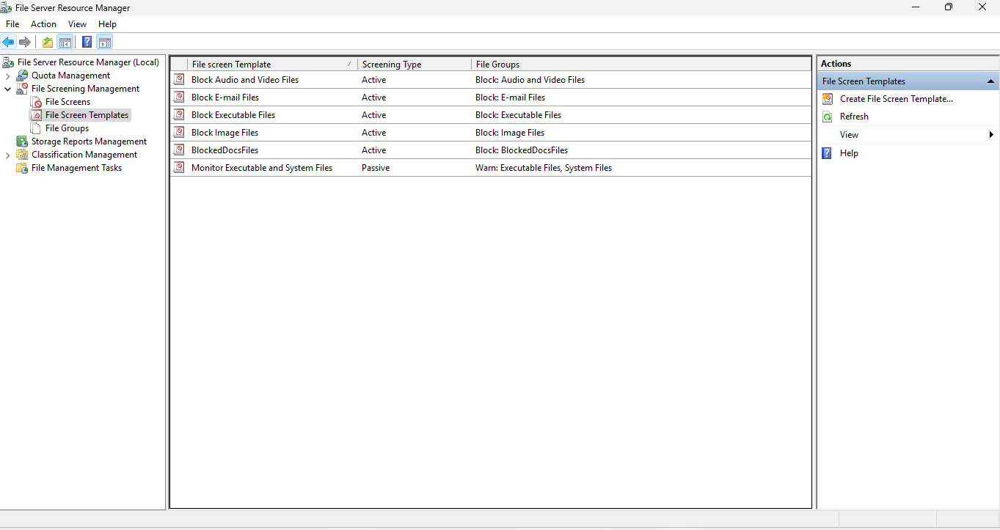  
  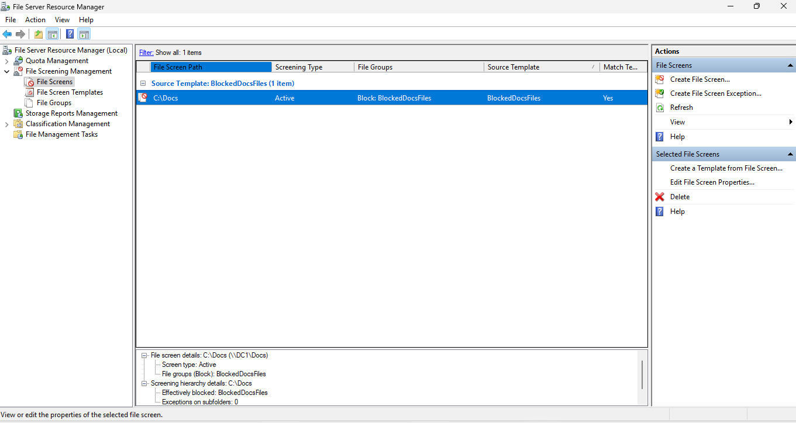

> **Production note:** consider a dedicated file server/DFS; DC as file server is used here only for capstone demonstration.

---

## 🧩 Core Directory — AD DS, DNS, DHCP Failover
### Active Directory & DNS
- Join **DC2** to the domain and promote as an additional DC.  
- Verify health:  
  ```powershell
  repadmin /replsummary            # replication health
  netdom query fsmo                # Schema on DC2; others on DC1 (lab choice)
  ```
  _Evidence:_ 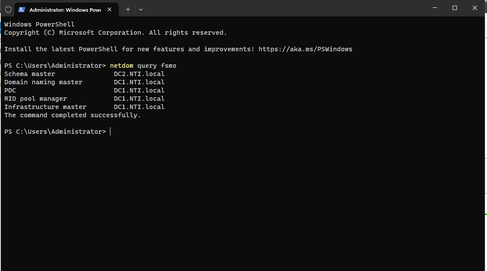

### DHCP Failover (Load Balance 50/50)
- Scope: `192.168.5.100–200`; Options: Router `192.168.5.1`, DNS `192.168.5.10, 192.168.5.20`, Domain `NTI.local`.  
- Failover: **Load Balance**, **Message Authentication** enabled, **State Switchover 60m**, **MCLT 10m **.  
  _Why MCLT:_ defines how long a partner can extend leases without full sync; small in lab to speed tests, usually higher in production.  
  _Evidence:_  
  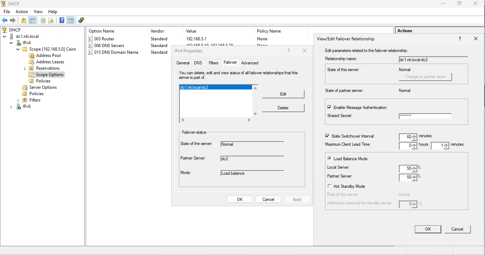  
  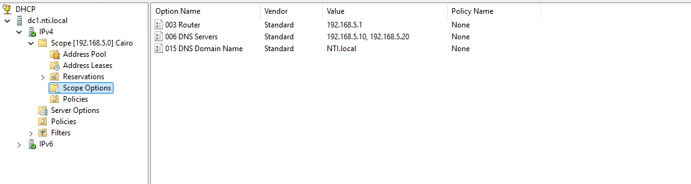

**PowerShell (equivalent)**  
```powershell
Add-DhcpServerv4Failover -ComputerName DC1 -Name "DC1-DC2" -PartnerServer DC2 `
  -LoadBalancePercent 50 -MaxClientLeadTime 00:01:00 -AutoStateTransition $true `
  -StateSwitchOverInterval 60 -SharedSecret (Read-Host -AsSecureString "SharedSecret")
```

---

## 🌐 Web Tier — Windows NLB + IIS (stateless HA)
**Design choices**  
- VIP: **192.168.5.50** → **`www.nti.local`**  
- **Multicast** mode; **Affinity=None** (stateless HTTP)  
- IIS binding on both nodes to **VIP + host header** (`www.nti.local`, port 80)

_Evidence:_  
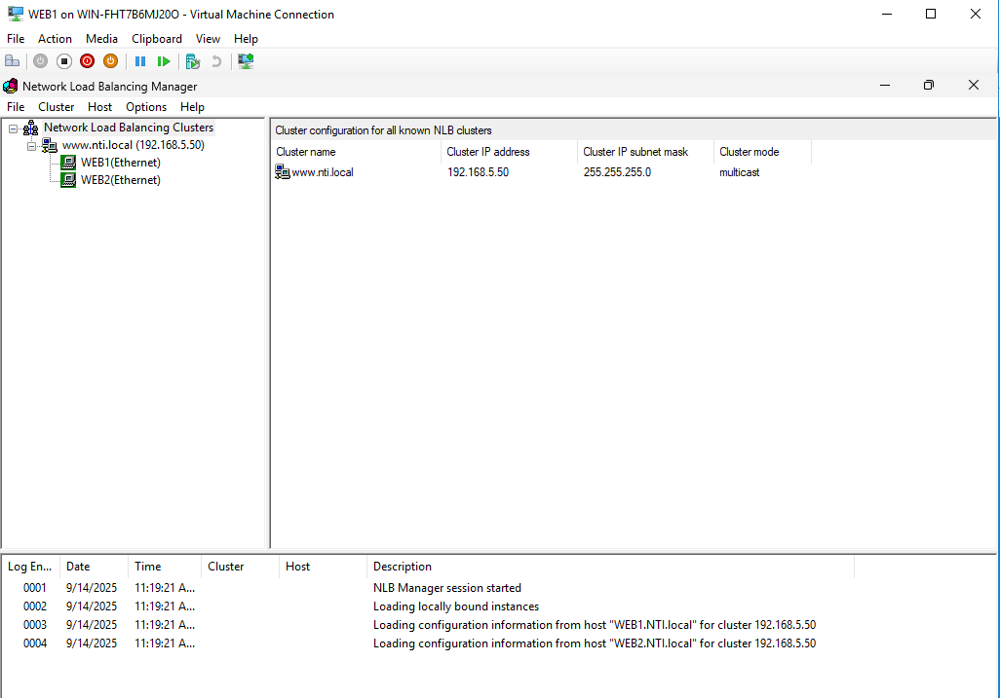  
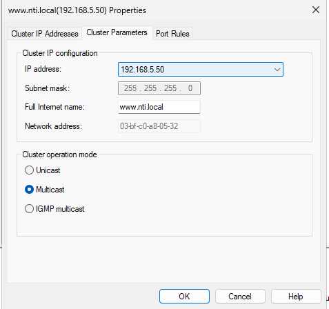  
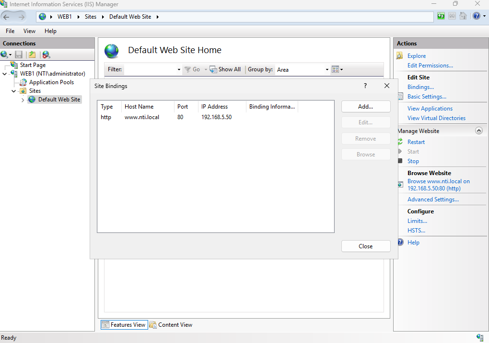  
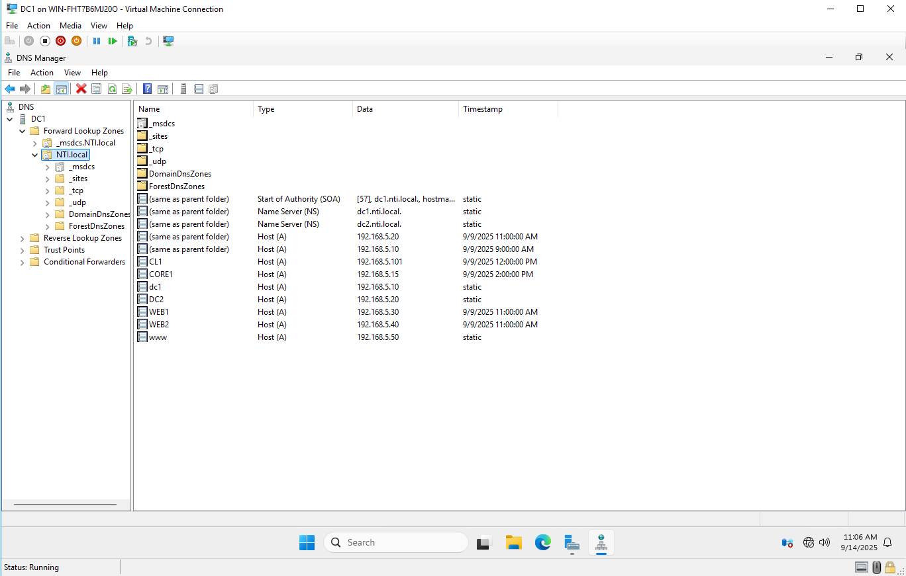

**Why NLB benefits production**  
- **Zero‑downtime maintenance:** patch one node at a time with **Drainstop/Resume**; users stay on the VIP.  
- **No app changes:** host‑header binding keeps URLs stable.  
- **Low cost:** built‑in for **stateless** internal apps; scale out by adding nodes.

**Design guardrails**  
- Multicast on physical networks may require **IGMP multicast** or static ARP entries to prevent flooding.  
- For sticky sessions, SSL offload, advanced health probes, or WAF features → **ARR / reverse proxy / dedicated LB**.

**PowerShell**  
```powershell
New-NlbCluster -InterfaceName "Ethernet" -HostName "WEB1" `
  -ClusterPrimaryIP 192.168.5.50 -ClusterName "www.nti.local" -OperationMode Multicast
Add-NlbClusterNode -NewNodeName "WEB2" -InterfaceName "Ethernet" -HostName "WEB2" -ClusterName "www.nti.local"
Add-NlbClusterPortRule -ClusterName "www.nti.local" -StartPort 80 -EndPort 80 -Protocol TCP -Affinity None

Import-Module WebAdministration
New-WebBinding -Name "Default Web Site" -IPAddress "192.168.5.50" -Port 80 -HostHeader "www.nti.local"
Add-DnsServerResourceRecordA -Name "www" -ZoneName "nti.local" -IPv4Address "192.168.5.50"
```

---

## 💽 (Lab) Storage — iSCSI Targets to Web Nodes
- LUNs on **DC2** presented to **WEB1/WEB2** to simulate shared data consumption.  
  _Evidence:_ 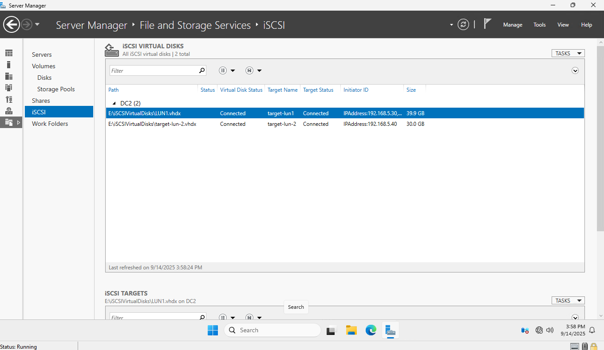
  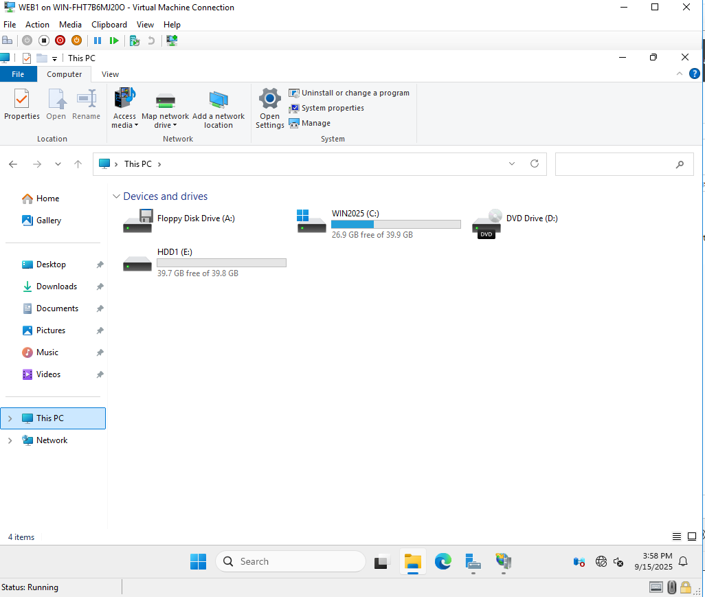  
- **Production note:** use **dedicated storage + MPIO**; do **not** co‑host iSCSI targets on a DC.

---

## 🛠️ Operations — Validation & Zero‑Downtime Runbooks
**Why this exists:** it proves the system works and lets any engineer operate it safely.

### A) Quick validation checklist (copy/paste)
```powershell
# Name resolution + HTTP reachability
nslookup www.nti.local
Test-NetConnection www.nti.local -Port 80
curl http://www.nti.local -UseBasicParsing

# Directory health & policy
repadmin /replsummary
netdom query fsmo
gpresult /r /scope user
gpupdate /force
```
**Expected:** `www.nti.local` resolves to **192.168.5.50**; HTTP returns content; replication is healthy; FSMO & GPOs align with this doc.

### B) Web node patching with **no outage**
1. In **NLB Manager**: right‑click node → **Drainstop** (serve existing sessions only).  
2. Patch/reboot the node.  
3. **Resume** the node; wait for *Converged*.  
4. Re‑test VIP & site (curl resolves and loads).

### C) DHCP continuity (partner failover)
1. On a client:  
   ```cmd
   ipconfig /release
   ipconfig /renew
   ```
2. Stop **DHCP Server** service on **DC1**; renew again → lease should still arrive (from **DC2**).  
3. Start **DHCP Server** on **DC1**; confirm state returns to **Normal**.

---

## 🔒 Production Enhancements & Next Steps
- **Monitoring & alerting:** track NLB node state, DHCP failover state, AD replication, and FSRM events with Event Viewer + Task Scheduler or a monitoring stack (e.g., Windows Admin Center/PerfMon/Prometheus exporters). Add a synthetic probe (scheduled `curl` to VIP).
- **Content & config:** store IIS content on a share (DFS/SMB) or use **IIS Shared Configuration** for consistency; for DevOps pipelines, publish artifacts via CI.
- **Hybrid identity (next lab):** add **Azure AD Connect** and synchronize users; secure with **Conditional Access** and **PIM** (demo‑friendly).  
- **Security hardening:** enable **HTTPS** with internal CA, apply **CIS** or Microsoft security baselines, and enforce modern TLS ciphers.

---

## 🗂️ Evidence Gallery (skim‑friendly)
(Inline proofs exist above; this gallery is for quick scanning.)  
NLB Manager & Properties • IIS Binding • DNS A Record • DHCP Failover & Scope Options • FSMO/repadmin outputs • FSRM (groups/templates/applied) • Loopback on DCs/Servers • **Doaa** Delegation • iSCSI LUNs (lab) • Validation Sheet

---

## 📦 Repo Structure
```
Image/
      (screenshots + validation-sheet.png)
*.drawio          # architecture sources (open in diagrams.net)
README.md         # this file
```

## ⚖️ License
Personal educational project based on NTI coursework. No production secrets included.  
License: MIT (optional).
